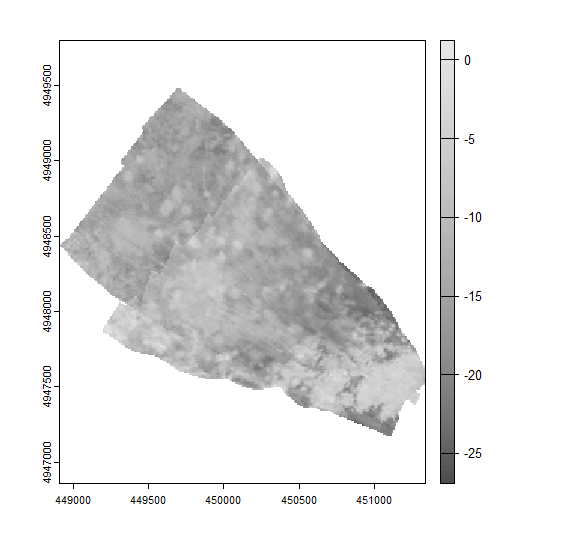
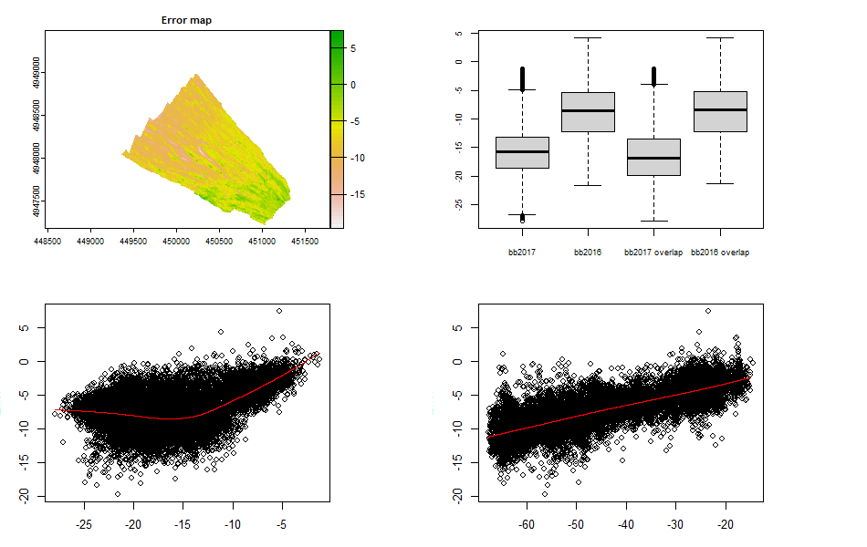
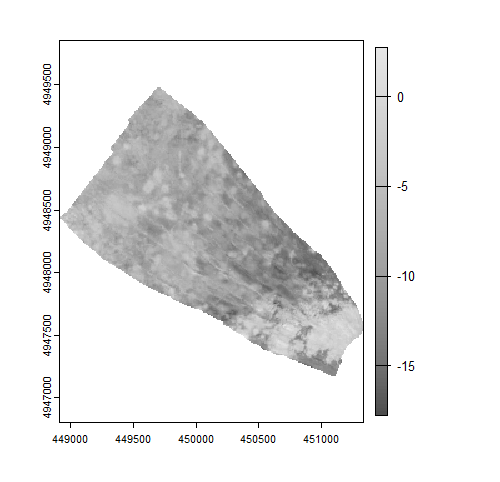
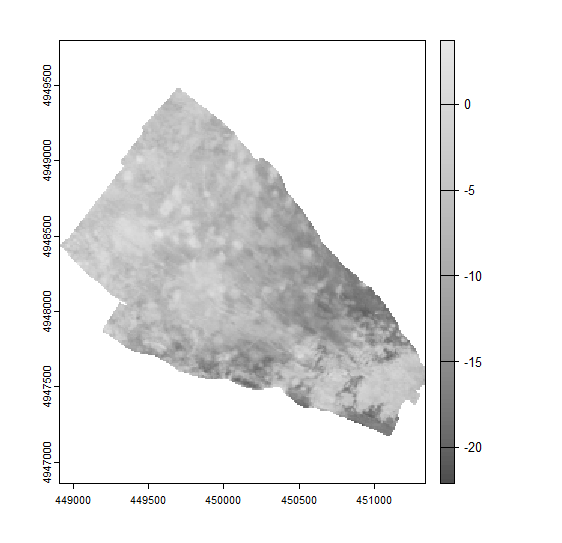
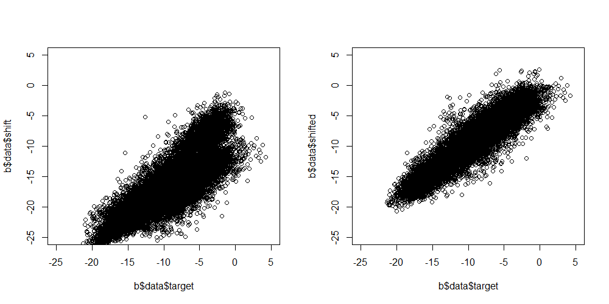
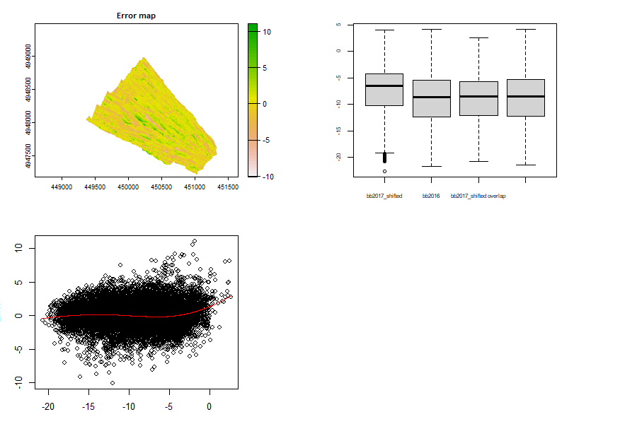

# bulkshift
[](https://doi.org/10.5281/zenodo.6363412)
### Backscatter raster harmonization for seabed mapping in R

This package facilitates relative calibration for processed sonar backscatter raster datasets using the methods described in Misiuk et al. (2020). 
It also extends these methods by providing functionality for advanced subsampling to handle dataset imbalance and spatial autocorrelation, and support for additional modelling methods. 

The functions in this package rely heavily on the [terra](https://github.com/rspatial/terra) package. RasterLayers are still supported, but the use of terra is highly 
recommended - it is meant to replace the [raster](https://github.com/rspatial/raster) package.

## Installation
You can use the remotes package to install bulkshift from github. Install remotes first if you do not have it. 
```
install.packages("remotes")
remotes::install_github("benjaminmisiuk/bulkshift")
```
## Functionality
Load the bulkshift and terra libraries. The terra package should have installed along with bulkshift. You can install
it explicitly using `install.packages("terra")`. While terra is not required to load bulkshift, you will need it
to read rasters into R.
```
library(terra)
library(bulkshift)
```
Example datasets from the Bedford Basin (Misiuk et al. 2020) are provided as part of the package. These are backscatter
datasets collected during two different surveys, and also a depth raster.
```
bb2016 <- rast(system.file('extdata', 'bb2016.tif', package='bulkshift'))
bb2017 <- rast(system.file('extdata', 'bb2017.tif', package='bulkshift'))
bbdepth <- rast(system.file('extdata', 'bbdepth.tif', package='bulkshift'))
```
These datasets are not calibrated, and mosaicking them as-is produces obvious artefacts where the values do not match between surveys:
```
plot(mosaic(bb2016, bb2017), col = gray.colors(100))
```


The workflow for relative calibration and mosaicking these datasets is broken into three parts using this package.
### 1. Data exploration
A function is provided to examine the spatial error between backscatter datasets, data distributions, and relationships between the error and other predictor variables such as depth (see Misiuk et al. 2020 for details).
```
par(mfrow = c(2,2))
bExplore(x = bb2017, y = bb2016, preds = bbdepth)
```


These images are normally plotted in sequence, but `par()` is used here to produce a single figure. We can see from the map that the error varies spatially. The first two boxplots show distributions of the full backscatter datasets, while the second two show distributions only where the datasets overlap, corresponding to the map. If the data at the area of overlap do not cover the full distributions of backscatter values, the models in the next step may need to extrapolate. The two scatterplots show how the error between datasets differs as a function of the 2017 dataset (left) and the water depth (right). A LOESS regression is fit by default to aid in vizualization, but can be disabled using `loess = FALSE`.
### 2. The bulk shift
At its most basic, the bulk shift performs relative calibration using the overlap between surveys:
```
b <- bulkshift(shift = bb2017, target = bb2016)
```
The result is a list with several objects, which may differ depending on the function arguments (e.g., `mosaic`, `savedata`, `crossvalidate`). We can inspect the model that was used to calibrate bb2017 just like any other model in R:
```
b$errorModel

#Call:  glm(formula = form, data = df)
#
#Coefficients:
#(Intercept)        shift  
#     3.7043      -0.2301  
#
#Degrees of Freedom: 16419 Total (i.e. Null);  16418 Residual
#Null Deviance:	    132200 
#Residual Deviance: 112300 	AIC: 78180
```
We can see that the model is a GLM. Recall that the response variable is the error between datasets, therefore, the coefficient for "shift" describes the change in error per unit of the "shift" backscatter dataset. The corrected backscatter layer can be plotted:
```
par(mfrow = c(1,1))
plot(b$shifted)
```


The bathymetry layer can be added as a covariate in the model, and we can create a mosaic of the backscatter layers. All additional covariates must be included as layers in a single SpatRaster and passed to the `preds` argument:
```
b <- bulkshift(shift = bb2017, target = bb2016, preds = bbdepth, mosaic = TRUE)
plot(b$mosaic, col = gray.colors(100))
```


### 3. Evaluation
After applying the `bulkshift()` function, we can observe statistics such as the variance explained (VE), mean absolute error (MAE), and Pearson correlation between the datasets before and after correction. If a proportion of data were set aside for validation using the `crossvalidate` argument, test statistics will additionally be returned. The model data are also returned by default, and relationships between backscatter datasets before and after correction can be compared. These data can additionally be used to calculate your own bespoke validation statistics, or to apply modelling methods that are not implemented in the package.
```
b$fitStats
#     layer         VE      MAE         r
#1  Original -2.1262196 7.469381 0.8151604
#2 Corrected  0.8556397 1.268409 0.9250079

par(mfrow = c(1,2))
plot(b$data$target, b$data$shift)
plot(b$data$target, b$data$shifted)
```


We could also call `bExplore` again to compare the "shifted" dataset to the "target":
```
par(mfrow = c(2,2))
bExplore(x = b$shifted, y = bb2016)
```


Finally, using the `bError` function we can vizualize and evaluate the fit of the error model using 2D plots if no additional predictors were supplied, or 3D plots if they were (as in this case). If `interactive = TRUE` an interactive 3D plot is generated using the [plot3Drgl](https://cran.r-project.org/web/packages/plot3Drgl/index.html) package.
```
bError(b)
```


# References
Misiuk, B., Brown, C.J., Robert, K., Lacharite, M., 2020. Harmonizing Multi-Source Sonar Backscatter Datasets for Seabed Mapping Using Bulk Shift Approaches. Remote Sensing 12, 601. https://doi.org/10.3390/rs12040601
